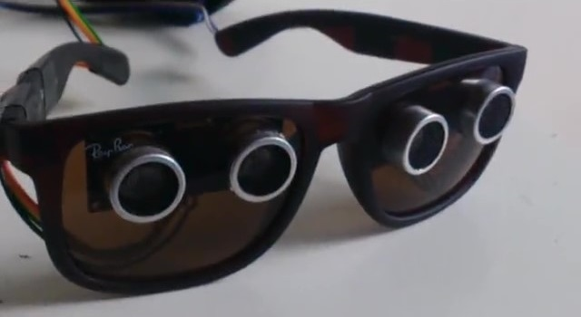

# Óculos para Pessoas com Deficiência Visual
Óculos para pessoas com deficiência visuais é um projeto de arduino que visa na acessibilidade das pessoas com esta deficiência.

## Introdução
Atualmente nossa sociedade se encontra em um período de frenética evolução tecnológica, em pouco tempo testemunharemos aquilo que antes apenas imaginávamos lendo os fantásticos livros futurísticos de Isaac Asimov ou assistindo filmes de *Steven Spielberg*, mas agora é real, e sabemos que tudo aquilo que antes achávamos impossível, se aproxima cada dia mais da realidade. Isso é empolgante, mas ao mesmo tempo, um pouco assustador, já que assim como nas histórias de ficção científica, uma característica que também afetará nossa sociedade é o individualismo e a solidão. Nessa era tecnológica, em meio às redes sociais, smartphones, dentre outras façanhas, as pessoas têm ficado cada vez mais distante e uma das outras. Estamos perdendo o senso de comunidade, que até décadas atrás era necessário para sobreviver, mas a impressão que temos é que a interação humana é desnecessária, e com isso cada dia que passa nos importamos menos com o próximo. E por isso, é necessário que venhamos a repensar nossos papéis dentro da sociedade, se queremos fazer parte da massa que apenas enxerga aquilo que está a sua frente, ou queremos fazer a diferença e fazer do mundo um lugar menos frio e mais caloroso. 

### Vídeos
- [Explicação do óculos](midia/projeto.mp4?raw=true)
- [Testemunha](midia/testemunha.mp4?raw=true)

## Metodologia 
A metodologia usada para desenvolver o projeto foi através de pesquisa das tecnologias existentes para a criação dos óculos que fossem acessíveis e portáteis, pois a intenção era focar na portabilidade e uma boa usualidade do *gadget*. 

## Lista dos equipamentos
- 1 Placa Uno R3 + Cabo USB para Arduino
- 2 Sensores de Distância Ultrassônico HC-SR04
- 1 Buzzer Dc 5v
- Jumper - Macho / Fêmea
- 1 Óculos escuro
- 1 Ferro de Solda 

## O Projeto 
A ideia inicial do projeto foi desenvolver um gadget para uma aplicação social e que poderia ser de fácil acesso. Foi estudada várias possibilidades, contudo, a maioria não era algo muito acessível, e através de alguns impasses inviáveis chegamos à ideia dos óculos. 

Os óculos para deficiente visual possuem dois sensores ultrassônicos acoplados às lentes. Os sensores são ligados ao Arduino por fios, e o Arduino pode ser guardado em um pequeno case, o qual o usuário pode prender no braço. Dessa forma o aparelho não se torna pesado e nem invasivo, evitando atrapalhar o dia a dia da pessoa. O seu funcionamento se dá basicamente através dos sensores, que funcionam como um sonar. Ele emite uma onda sonora de alta frequência, quando essa onda se choca em algum objeto, e quando esse objeto reflete essas ondas, o eco resultante é recebido de volta para o sensor e convertido em um sinal elétrico. Através da programação do controlador Arduino é possível controlar a distância máxima e mínima que esse sensor trabalhará. Quando o usuário se encontra próximo de obstáculos um *buzzer* começa a emitir sinais sonoros de forma intervalada, quanto mais próximo se encontra o objeto, o sinal sonoro passa a ficar contínuo, assim o usuário tem noção da distância que se encontra o obstáculo. Sabendo que o *buzzer*, é algo que pode vir a incomodar o usuário, é possível substituí-lo por um aparelho vibratório, tornando-se assim mais sutil. 

As ondas emitidas pelos sensores alcançam uma angulação baixa, por isso se o usuário está andando, só conseguirá perceber obstáculos que estejam na direção para qual o sensor está localizado.  **A intenção desse *gadget* não é excluir a bengala, ou outros acessórios assistíeis, mas sim, dar ao deficiente visual uma maior noção do ambiente em que ele se encontra, e deixá-lo mais confiante e seguro.** 

Esse projeto encontra-se em um nível básico e experimental, mas existe uma gama de aplicações para desenvolvê-lo, e deixa-lo mais inteligente, como por exemplo, o uso de uma câmera para reconhecimento facial e de padrões junto com uma assistente digital, que daria informações ao usuário sobre o espaço em que se encontra, e descrição dos obstáculos à sua frente.  

## Considerações Finais 
Ao finalizar o projeto percebemos que não é necessário ser um gênio para mudar o mundo, ou criar grandes invenções. Muitas vezes, uma ideia simples pode fazer grande diferença, o que importa é o desejo real de ajudar as pessoas e realmente querer contribuir de alguma forma para uma sociedade mais igualitária e menos egoísta. E que a sensação de contribuir para algo maior é muito gratificante. 

**Por fim, nossos agradecimentos aos solidários da oficina ótica, em Santa Amaro. Eles não cobraram nada pelo trabalho em corta as lentes dos óculos.**

## Créditos
- Faculdade: FATEC Zona Sul - Análise e Desenvolvimento de Sistema - 1º Semestre - 20/10/2017
- Aluno: Gustavo Santos, Marcello Silvério e Plínio Mendonça                                                                  
- Orientador: Prof. Galvão                                               
- Revisor: Profª. Me. Rebecca Bignardi Arambasic Rebelo da Silva

## Referência
Instituto NCB <http://www.newtoncbraga.com.br> Acessado em 20/10/2017 às 15h30min  MCROBERTS, Michael. Arduino Básico. São Paulo. Novatec: 2011. 
